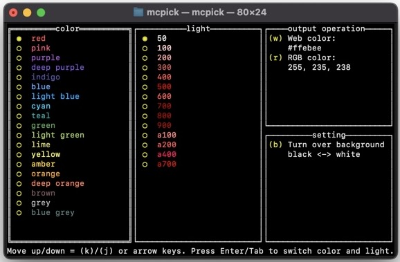

# mcpick
Light weight Terminal User Interface (TUI) to pick material colors.
You do NOT need to take your hands off the keyboard to pick colors.



## Getting started
Here, I introduce two methods. If `go` is installed, the first method would be more convenient.

### Method 1: With `go get`
1. `go install github.com/tenkoh/mcpick`
2. add `$GOPATH/bin` to `$PATH`

### Method 2: Manual install
1. Save the binary file `mcpick` in any directory. The binary files are listed on [release page](https://github.com/tenkoh/mcpick/releases).
1. Add the path to PATH.

## Usage
1. Select color and light which you like.
    - Move up/down by `k` / `j` or arrow keys
    - Switch color and light by `Enter` or `Tab`
2. Select output style. Note: after hit the key, this app immediately closes.
    - `w`: web color style (#ffffff)
    - `r`: rgb color style (255, 255, 255)

- Hit `b` to switch background color.
- Hit `Ctrl + C` to quit.

## Advanced usage
This app **JUST** outputs color code to the terminal. You can combinate this app with others like `pbcopy` in MacOS or `clip` in Windows.

### Example: MacOS
The example below copies color code to the clipboard. The most convenient way is make alias in your `.bashrc` or `.zshrc`.

```shell
mcpick | pbcopy
```

### Example: Windows
The example below copies color code to the clipboard. The most convenient way is make `.bat` file and add the path to `PATH`.

```shell
mcpick | clip
```

## Contribute
I'm really welcome your contribution.